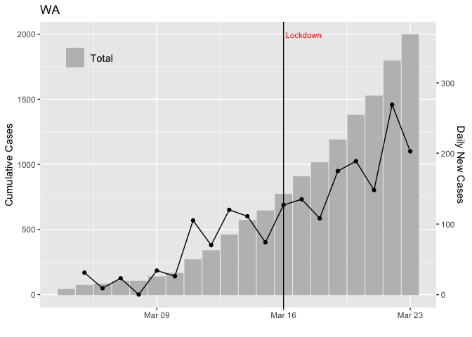
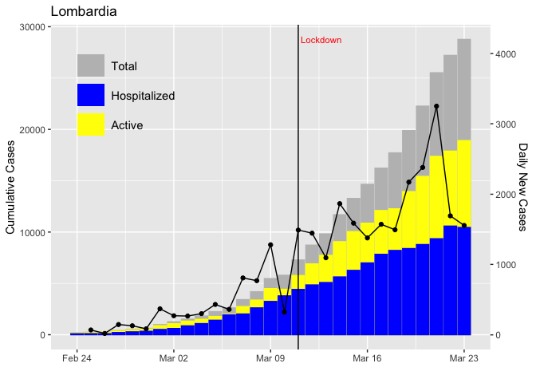
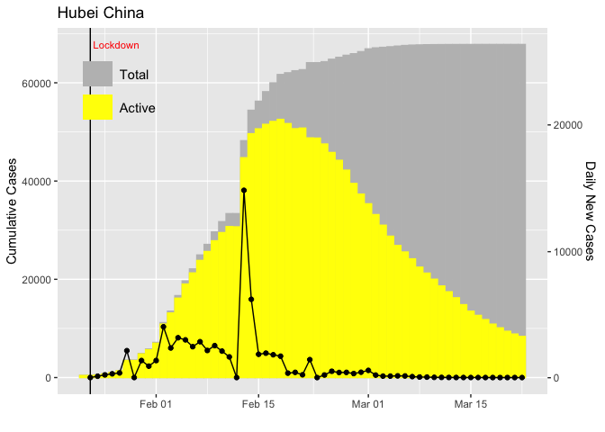
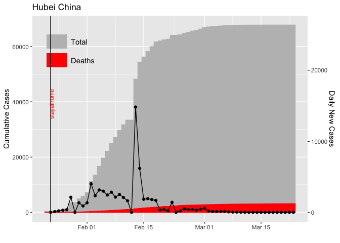

CoV19
================
Eli Holmes

This is a package for exploring some of the CoV-19 data. The world data
is downloaded from JHU. The US data is downloaded from JHU and
CovidTracking. The Italy data is downloaded from the Italian CDC
(Protezione Civile)

Sources:

  - <https://github.com/CSSEGISandData/COVID-19>
  - <https://covidtracking.com/api/>
  - <https://github.com/pcm-dpc/COVID-19>

To install the package

    library(devtools)
    install_github(eeholmes/CoV19)

To get the data, type any of these on command line. After loading.

    states
    italy
    world

Use `head()` to look at it. Should be pretty self-evident what it is.

# Functions

  - `regions()` will show you the regions in each data set
  - `plot2()` a basic plot of total, hospitalized, and deaths

# Plots

``` r
library(CoV19)
plot2(italy, "Lombardia", decorate=TRUE)
```

<!-- -->

``` r
plot2(states, c("WA","CA"))
```

<!-- -->

``` r
plot2(states, c("NY","NJ","PA","MA"))
```

<!-- -->

Something is odd with the Hubei data in the JHU data set.

``` r
plot2(world, "Hubei China", decorate=TRUE)
```

<!-- -->
